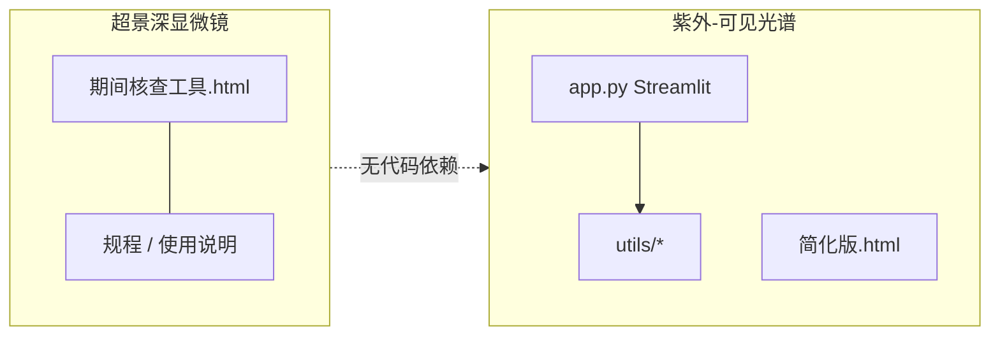

# 项目架构说明

本文描述 `子料 v0.0.3` 两套工具的技术边界、数据流与关键实现，供维护与二次开发参考。

---

## 总体关系



两套工具**零代码耦合**：不同运行环境、不同输出形态，仅同属一个 Git 仓库便于版本归档。

---

## 一、超景深显微镜期间核查工具

### 技术栈

| 层级 | 选型 |
|------|------|
| 运行时 | 浏览器（Chrome / Edge 推荐） |
| UI | Tailwind CSS v3（CDN） |
| 图标 | Font Awesome 4.7（CDN） |
| 图表 | Chart.js 4.4（CDN） |
| 持久化 | 无；报告由打印/另存 PDF |

单文件约 2500+ 行：`#超景深显微镜期间核查工具.html` 内含 HTML、样式与全部 JavaScript。

### 向导与状态

- **9 个步骤**：基本信息 → 外观 → EXY → EZ → EV → PV → P2D → PZ → 综合结果/报告。
- **状态模型**：DOM 表单字段即状态；`calculate*` 函数在 `input`/`blur` 时触发重算。
- **演示数据**：`loadDemoData()` 类函数一次性填充各步示例值。

### 核心算法

#### EXY / EZ / EV（尺寸类）

- 输入多为 **μm**，内部换算为 **mm** 后与标准值（mm）比较。
- **示值误差**：`error = avg - L_std`
- **重复性**：三次测量的极差 `max - min`
- **允差**（JJF 1318 相关表述，工具内实现）：
  - 示值误差：`|error| ≤ 0.01 × L`（即 ±1%×L）
  - 重复性：`repeatability ≤ 0.0033 × L`（即 ±0.33%×L）

#### PV / P2D（圆探测类）

- **最小二乘圆拟合** `leastSquaresCircleFit(points)`：代数法求圆心 `(centerX, centerY)` 与半径；各点到圆心距离极差为 PV/P2D。
- PV：15 点；P2D：25 点；合格阈值参考 **≤10 μm**。
- 拟合失败（点近似共线）时 `denominator ≈ 0` 抛出错误并提示用户。

#### PZ（变倍）

- 三个倍率 200X / 150X / 100X 下记录十字对准刻度尺的 X、Y 坐标，计算 ΔX、ΔY 及合成 PZ。

### 报告生成

- 步骤 9 将各步 DOM 数据汇总到打印专用区域。
- `@media print` 控制 3 页 A4 分页（`page-break-after`）。
- 不生成独立文件；依赖浏览器「打印 → 另存为 PDF」。

### 运维注意

- **CDN 依赖**：离线环境需将 Tailwind / Chart.js 等改为本地静态资源。
- **文件名**：主 HTML 以 `#` 开头，部分工具链可能对 URL 编码敏感，重命名时需同步更新规程与说明中的引用。

---

## 二、UV-Vis 光谱导数分析（完整版）

### 技术栈

| 层级 | 选型 |
|------|------|
| UI 框架 | Streamlit ≥1.40 |
| 可视化 | Plotly；交互点击依赖 `streamlit-plotly-events` |
| 数值计算 | NumPy、Pandas、SciPy（`savgol_filter`、`find_peaks`、稀疏矩阵 ALS） |
| 导出 | openpyxl、XlsxWriter、kaleido（PNG） |
| 编码检测 | chardet（可选） |

入口：`app.py`（`main()`）；业务逻辑在 `utils/` 包。

### 模块职责

| 模块 | 职责 |
|------|------|
| `data_loader.py` | 上传文件解码（多编码）、分隔符与表头识别，输出 `wavelength`/`intensity` DataFrame |
| `preprocessing.py` | `crop_spectrum`、`savgol_smooth`、`_als_baseline` / `baseline_correction`、`preprocess_spectrum` 流水线 |
| `derivative.py` | `compute_derivatives`（处理降序波长）、`add_derivatives_columns`、`detect_peaks` |
| `conversion.py` | T↔A、反射率↔K-M 及 `convert_data_type` |
| `export.py` | 多 Sheet Excel（含分析信息页）、PNG/HTML 图导出 |
| `config_manager.py` | `presets.json` 读写；`DEFAULT_CONFIG` 与 session_state 同步 |

### 数据处理流水线

```text
上传文件
  → load_spectrum_from_uploaded_file
  → [可选] convert_data_type（类型转换）
  → [可选] crop_spectrum（波长范围）
  → preprocess_spectrum（平滑 + ALS 基线）
  → add_derivatives_columns（一阶、二阶导数列）
  → [可选] detect_peaks → 写入 session_state marks
  → build_figure / build_merged_figure / build_single_subplot
  → export_to_excel / export_figure_*
```

### Session 状态（Streamlit）

| 键 | 用途 |
|----|------|
| `marks` | 自动极值 + 手动标记列表 |
| `reference_lines` | 竖直参考线（含和田玉预设 435/535/575 nm） |
| `data_conversion` | 待应用的数据类型转换 |
| `smooth_win` 等 | 与 `DEFAULT_CONFIG` 对齐的算法参数 |

换文件时清除 marks、reference_lines、crop_range 等，避免串样。

### 视图模式

1. **四图总览**：2×2 子图（原始 / 预处理 / 一阶 / 二阶）。
2. **合并视图**：多曲线叠加对比峰位。
3. **单图放大**：配合 plotly 点击事件填入标记坐标。

### 启动脚本

`启动应用.bat`：检测/重建 `.venv`、按 `requirements.txt` 安装依赖（失败时尝试清华镜像）、`streamlit run app.py --server.port 8501`。

### 测试与校验脚本（非主流程）

- `tests/test_algorithms.py`：导数符号、K-M 往返、噪声等单元测试。
- `verify_algorithms.py`、`analyze_data_files.py`：开发期算法与样例文件校验。

---

## 三、UV-Vis 简化版（HTML）

- **依赖**：Tailwind、Plotly、math.js（均为 CDN）。
- **算法**：在浏览器内实现 Savitzky-Golay（math.js 矩阵运算），无 ALS 基线、无预设/多视图/Excel 品牌页。
- **定位**：便携演示与无 Python 环境时的轻量分析；**不以简化版为准** 替代完整版鉴定流程。

---

## 四、版本与发布物

| 文件 | 含义 |
|------|------|
| `VERSION` | 语义化版本号（当前 0.0.3） |
| `CHANGELOG.md` | 仓库级变更记录 |
| 子目录内 README / 用户手册 | 各工具操作与业务说明 |

**未纳入仓库的常见本地文件**：`.venv/`、Streamlit 缓存、用户导出的 xlsx/png（见根目录 `.gitignore`）。

**可选资源**：完整版 `app.py` 引用同目录 `logo.png`；若缺失仅影响页眉图标，不影响计算功能。

---

## 五、扩展建议

| 需求 | 建议改动位置 |
|------|----------------|
| 新增核查项 | 超景深 HTML：新 step 区块 + `calculate*` + 报告模板 |
| 调整允差公式 | 对应 `calculateEXYRow` 等函数内 `mpe` / `mpeR` |
| 新光谱预处理算法 | `utils/preprocessing.py` + `app.py` 侧栏参数 |
| 新导出格式 | `utils/export.py` |
| 离线部署超景深工具 | 下载 CDN 资源并改 `<script>` / `<link>` 为相对路径 |

修改判定或算法后，务必与 `1.3期间核查规程.md` 或光谱相关标准/指南交叉核对。
